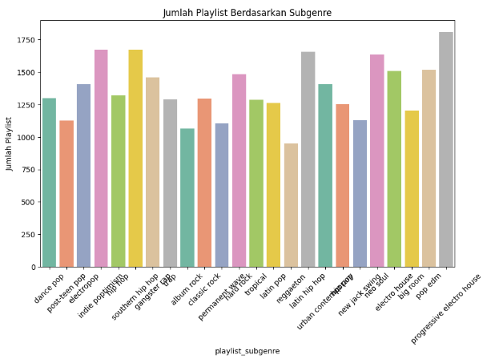
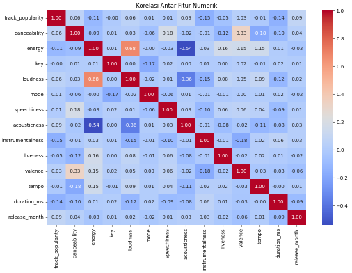

# 🎵 Spotify Songs Analysis Project 🎶

<p align="center">
  
</p>

---

## 👨‍💻 Team
- *RESTY PUTRI SUCI YANI - 202110370311180*
- *KENS URGANIS AWANGSARI PUTTRISIA S. - 202110370311273*

---


## 🎯 Problem Statement
Tujuan utama dari proyek ini adalah untuk menganalisis dataset lagu Spotify guna mengungkap wawasan terkait popularitas lagu, distribusi genre, dan hubungan antara berbagai fitur audio dengan popularitas lagu. Analisis ini bertujuan untuk memberikan wawasan yang dapat ditindaklanjuti bagi produser musik, pemasar, dan kurator playlist untuk meningkatkan strategi mereka dalam promosi lagu dan pembuatan playlist.

---

## 🚀 Business Objectives
1. **🌟 Memahami Faktor Popularitas:** Mengidentifikasi fitur audio (misalnya, energi, danceability) yang secara signifikan memengaruhi popularitas lagu.
2. **🎧 Analisis Genre:** Menganalisis distribusi lagu di berbagai genre dan subgenre untuk memahami preferensi pendengar.
3. **📋 Optimasi Playlist:** Memberikan wawasan tentang genre dan subgenre yang paling populer, membantu dalam pembuatan playlist yang efektif.
4. **📅 Tren Rilis:** Memeriksa tren dalam rilis album dari waktu ke waktu untuk mengidentifikasi periode puncak untuk musik baru.

---

## 🗂️ Variables Information
| Variable                | Description                                     |
|-------------------------|-------------------------------------------------|
| track_popularity        | Skor popularitas lagu (0-100)                   |
| track_name              | Nama lagu                                       |
| track_artist            | Artis dari lagu                                 |
| track_album_name        | Nama album                                      |
| track_album_release_date| Tanggal rilis album                             |
| playlist_genre          | Genre dari playlist                             |
| playlist_subgenre       | Subgenre dari playlist                          |
| duration_ms             | Durasi lagu dalam milidetik                     |
| energy                  | Tingkat energi lagu (0-1)                       |
| danceability            | Skor danceability (0-1)                         |
| loudness                | Kerasnya lagu dalam desibel                     |
| tempo                   | Tempo lagu dalam BPM                            |
| acousticness            | Skor akustik (0-1)                              |
| instrumentalness        | Skor instrumental (0-1)                         |
| valence                 | Skor valensi (0-1)                              |
| speechiness             | Skor speechiness (0-1)                          |
| liveness                | Skor liveness (0-1)                             |


---

## 🔍 Insights and Observations
1. **📉 Missing Values:** Dataset memiliki nilai hilang di beberapa kolom kategorikal, yang diisi dengan modus dari masing-masing kolom.
2. **⚠️ Outlier:** Outlier dalam variabel kontinu ditangani menggunakan metode Rentang Interkuartil (IQR), memastikan analisis yang lebih robust.
3. **🎶 Genre Popularity:** Genre dan subgenre tertentu menunjukkan skor popularitas rata-rata yang lebih tinggi, mengindikasikan preferensi pendengar.
4. **💥 Energy Popularity:** Ditemukan korelasi positif antara tingkat energi dan popularitas lagu, menunjukkan bahwa lagu yang lebih energik cenderung lebih populer.
5. **📊 Tren Rilis:** Analisis tanggal rilis album mengungkapkan bulan-bulan tertentu dengan frekuensi rilis yang lebih tinggi, yang dapat menginformasikan strategi pemasaran.

---

## 📂 File Structure

```
UAS_Analisis_Data/
├── bigdata.txt                          
├── project_analisis_big_data.ipynb
├── README.md
├── image/        
```

## 🧰 Steps and Code Explanation

### *1. Import Library*
python
import pandas as pd
import numpy as np
import matplotlib.pyplot as plt
import seaborn as sns

- Library untuk analisis data dan visualisasi.

### *2. Load Dataset*
python
path='/content/drive/MyDrive/Project Analisis Big Data/spotify/spotify_songs.csv'
df=pd.read_csv(path)
df.head()

### *3. Data Cleaning*
python
missing_values = spotify_df.isnull().sum()
spotify_df.fillna(spotify_df.mode().iloc[0], inplace=True)

- Mengisi nilai kosong dengan modus untuk kategorikal.

### *4. Outliers Handling*
python
for col in numerical_columns:
    Q1 = spotify_df[col].quantile(0.25)
    Q3 = spotify_df[col].quantile(0.75)
    IQR = Q3 - Q1
    lower_bound = Q1 - 1.5 * IQR
    upper_bound = Q3 + 1.5 * IQR
    spotify_df = spotify_df[(spotify_df[col] >= lower_bound) & (spotify_df[col] <= upper_bound)]

- Outlier ditangani menggunakan IQR.

### *5. Exploratory Data Analysis (EDA)*
- *Unvariate Analysis*:
python
plt.figure(figsize=(18, r * 3))
for n, var in enumerate(target_variables):
  plot = plt.subplot(r, 3, n + 1)
  sns.countplot(x=new_df[var], ax=plot).margins(y=0.15)
  plt.title(f'{var.title()}', weight='bold')
  plt.tight_layout()
  annot_percent(plot)

  
(Placeholder image: Unvariate Analysis plot)

- *Bivariate Analysis*:
python
plt.figure(figsize=(12, 8))

numeric_df = df.select_dtypes(include=np.number)

sns.heatmap(numeric_df.corr(), annot=True, cmap='coolwarm', fmt='.2f', cbar=True)
plt.title('Korelasi Antar Fitur Numerik')
plt.show()

  
(Placeholder image: Bivariate Analysis plot)

- *Multivariate Analysis*:
python
# Memilih kolom numerik yang relevan
numerical_features = ['track_popularity', 'danceability', 'energy',
                      'key', 'loudness', 'speechiness', 'acousticness',
                      'instrumentalness', 'liveness', 'valence', 'tempo', 'duration_ms']

new_df2 = df[numerical_features]

# Plotting pair plot untuk kolom numerik
plt.figure(figsize=(12,10))
sns.pairplot(new_df2)
plt.suptitle('Pair Plot Fitur Numerik Dataset Sportify', y=1.02)  # Menambahkan judul
plt.show()

  
(Placeholder image: Multivariate Analysis plot)

---

## 💡 Solutions to Business Objectives
1. **🎼 Pembuatan Playlist:** Gunakan wawasan tentang genre dan subgenre yang populer untuk mengkurasi playlist yang sesuai dengan preferensi pendengar.
2. **📣 Strategi Pemasaran:** Fokus pada promosi lagu dengan energi dan danceability tinggi, karena fitur-fitur ini berkorelasi dengan popularitas yang lebih tinggi.
3. **⏳ Waktu Rilis:** Jadwalkan rilis baru selama bulan-bulan puncak yang diidentifikasi dalam analisis untuk memaksimalkan visibilitas dan keterlibatan pendengar.

---

## 🛠️ Challenges
1. **📂 Kualitas Data:** Adanya nilai hilang dan outlier memerlukan penanganan yang hati-hati untuk memastikan integritas analisis.
2. **🔗 Hubungan yang Kompleks:** Memahami hubungan multifaset antara berbagai fitur audio dan popularitas memerlukan teknik statistik yang lebih canggih.
3. **🌐 Sifat Dinamis Tren Musik:** Tren musik dapat berubah dengan cepat, sehingga penting untuk terus memperbarui analisis dengan data baru.

---

## 🔭 Future Work
1. **⏱️ Analisis Waktu Nyata:** Menerapkan sistem untuk analisis data waktu nyata agar tetap mengikuti perubahan tren musik.
2. **👂 Integrasi Umpan Balik Pengguna:** Menggabungkan umpan balik pengguna dan kebiasaan mendengar untuk meningkatkan akurasi wawasan.
3. **🔍 Prediksi Tren Popularitas:** Gunakan model machine learning untuk memprediksi popularitas lagu.


---

## ✅ Conclusion
Analisis dataset lagu Spotify memberikan wawasan berharga tentang faktor-faktor yang memengaruhi popularitas lagu dan preferensi pendengar. Dengan memahami hubungan antara fitur audio dan popularitas, serta distribusi genre, para pemangku kepentingan dapat membuat keputusan yang lebih baik terkait promosi musik dan pembuatan playlist.

---

## 🛠️ How to Use
1. Clone repository ini ke komputer Anda.
   ```bash
   git clone <repository-url>
   ```
2. Instal semua dependensi yang diperlukan.
   ```bash
   pip install -r requirements.txt
   ```
3. Jalankan analisis dataset sesuai dengan notebook atau script yang disediakan.

---

### ⭐ Don't forget to give a star if you like this project, thankyou! ⭐

